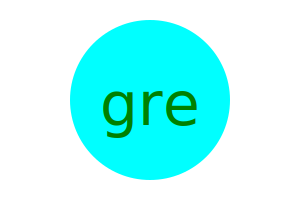

# supreme-svg-potato
Create and customize SVG logos with ease using this SVG generator app.

## Deployment
[Link to the github repo](https://github.com/RonaldMartin02/supreme-svg-potato)

[Link to a video demo](https://drive.google.com/file/d/1kouBBFwtaef3eqnLfd2CJW_X0NmMMTka/view)

## Installation
No installation is required to use this SVG generator app. Simply access it through your web browser.

## Usage
To use this SVG generator, follow the steps below:
    
    Clone the Repository:
        git clone https://github.com/your-username/your-svg-generator.git
    
    Navigate to the Project Directory:
        cd your-svg-generator
    
    Install Dependencies:
        npm install
    
    Run the SVG Generator:
        node index.js
Follow the Prompts:

    Enter up to three characters for the text.
    Enter the text color using a color keyword or hexadecimal number.
    Choose a shape from the options: 'circle', 'square', 'triangle'.
    Enter the shape color using a color keyword or hexadecimal number.

Generate SVG:

    The SVG generator will process your input and generate an SVG file named "logo.svg" in the project directory.

View the Result:

    Open "logo.svg" to view your customized SVG graphic.

## Contributing
Contributions are welcome! If you have suggestions, feature requests, or find a bug, please open an issue or create a pull request.

## Credits

N/A

## License

MIT License